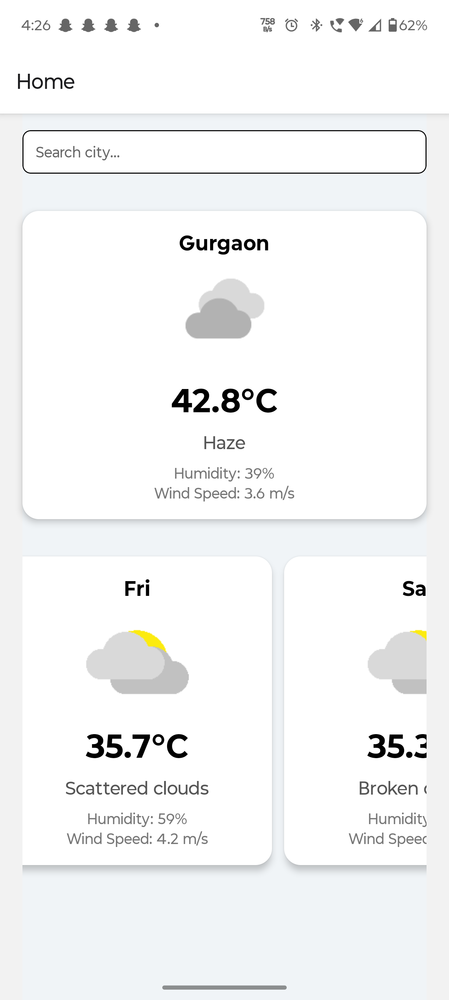
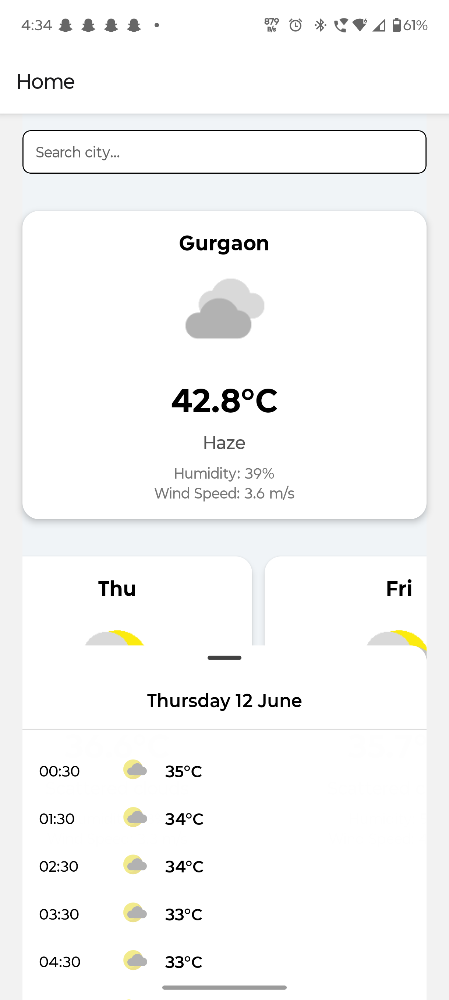

# 🌦️ WeatherApp

A clean, minimal React Native & Expo app that shows current weather, a 5‑day forecast, and tappable daily cards revealing hourly forecasts.

---

## 🚀 Features

- 🔍 **Search by City** or use your **Current GPS Location**  
- 📅 **5‑Day Forecast** displayed in a horizontal list  
- 🕒 **Hourly Timeline** appears in a bottom sheet when you tap a day’s card  
- 🔄 **Pull‑to‑Refresh**: drag the forecast screen downward to refresh all weather data  
- ❌ **Missing Data Alerts**: shows a toast if hourly data is unavailable for the selected day  
- 📱 **SafeAreaView** support to prevent content from overlapping notches/status bars  
- 📐 **Consistent Card Layout**: uniform card widths and spacing  

---

## 📷 Screenshots

**Current Weather**  


**Hourly Forecast Sheet**  



## 📋 Prerequisites

- **Node.js** v14 or newer  
- **Expo CLI** installed globally:  
  ```bash
  npm install -g expo-cli